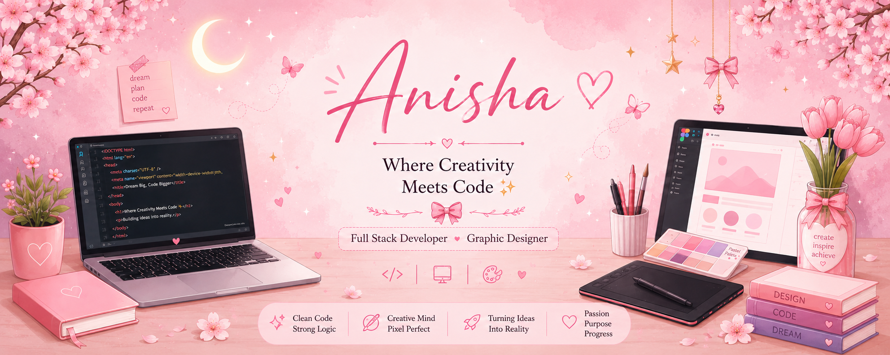

<h3>💖 Full Stack Developer | Graphic Designer | UI/UX Enthusiast</h3>

Passionate about building beautiful, responsive, and scalable web applications while creating modern and creative designs.

  
  

---

## 🌸 About Me

✨&nbsp; Full Stack Developer 
🎨&nbsp; Graphic Designer &amp; Creative UI Designer 
💻&nbsp; Passionate about Web Development 
🚀&nbsp; Building modern &amp; responsive websites 
📚&nbsp; Always learning new technologies 
🤝&nbsp; Open for collaboration

---

## 🛠 Tech Stack

<b>🎨 Frontend</b>

<b>⚙️ Backend</b>

<b>🗄 Database</b>

<b>🎨 Design</b>

<b>🧰 Tools</b>

---

## 🎯 What I Do

---

## 📊 GitHub Stats

---

## 🐍 Contribution Snake

---

## 🌍 Connect with Me

---

💬 *"Dream • Design • Develop • Deploy 🚀"*

